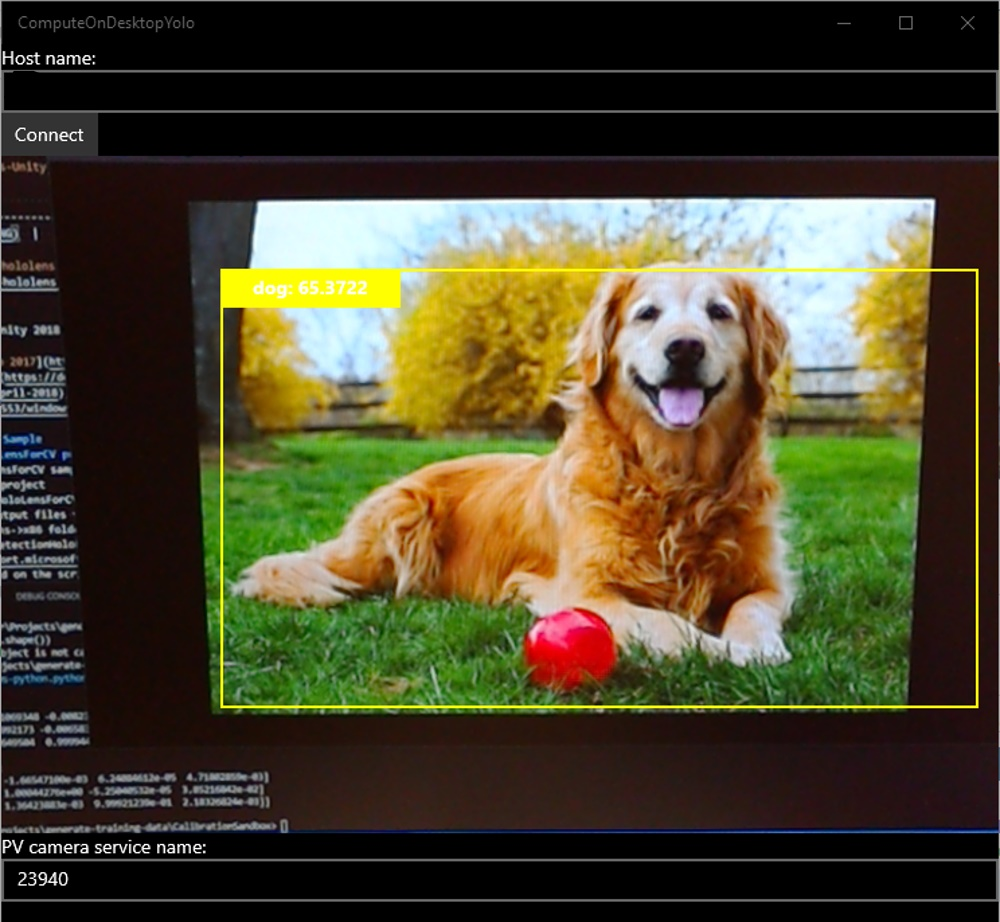
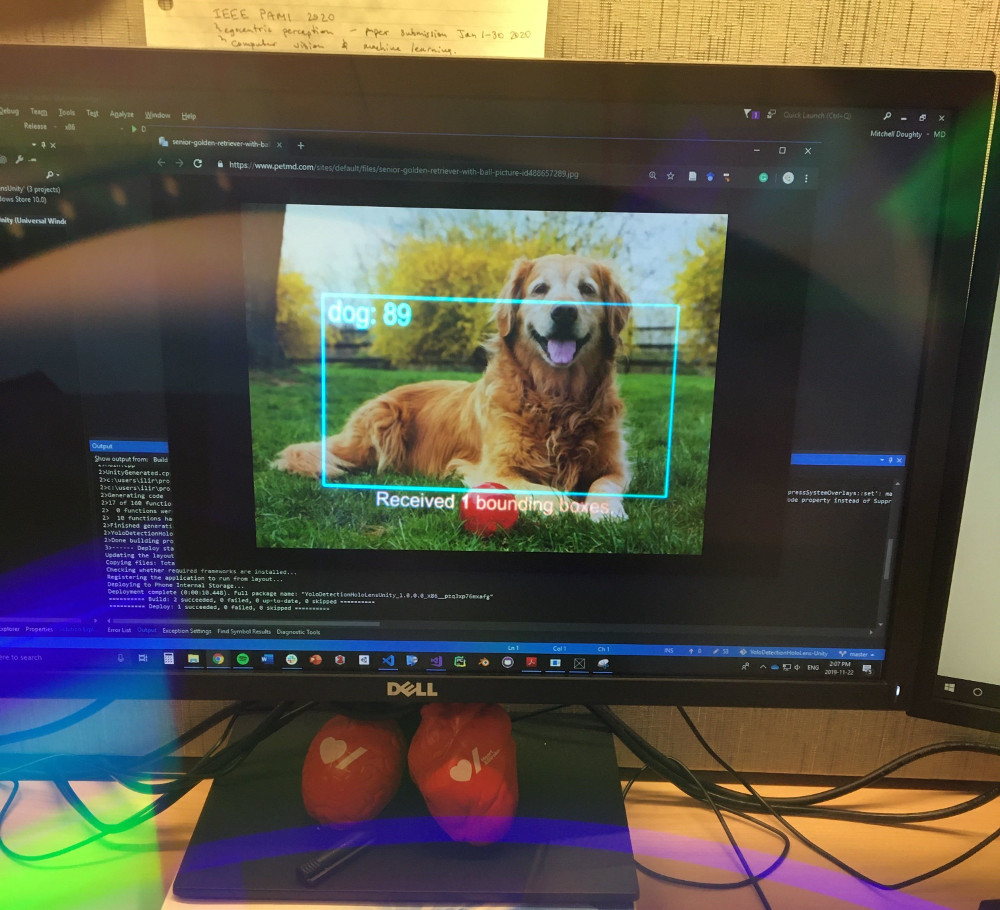

# YoloDetectionHoloLens-Unity
Object detection sample using the Yolo framework, HoloLens photo/video sensor stream, and HoloLens device for visualization of bounding boxes. C++ project to receive PV sensor frames, and send bounding boxes is made available for use in Unity through [IL2CPP Windows Runtime support](https://docs.unity3d.com/2018.4/Documentation/Manual/IL2CPP-WindowsRuntimeSupport.html). More details are presented in my [blog post](https://doughtmw.github.io/posts/YoloDetection-Unity-3).

Incorporates:
- Modified [HoloLensForCV](https://github.com/microsoft/HoloLensForCV) sample from Microsoft 
- [BoundingBoxUtils-Unity](https://github.com/doughtmw/BoundingBoxUtils-Unity) sample

Desktop (server)             |  HoloLens (client)
:-------------------------:|:-------------------------:
  |  

Difference in above bounding box size is caused by capturing frames from different time points and the viewing perspective through the HoloLens.

## Requirements
- Tested with [Unity 2018.4 LTS and Unity 2019.4 LTS](https://unity3d.com/unity/qa/lts-releases
)
- [Visual Studio 2017/2019](https://visualstudio.microsoft.com/downloads/)
- Minimum [RS4](https://docs.microsoft.com/en-us/windows/mixed-reality/release-notes-april-2018), tested with [OS Build 17763.678](https://support.microsoft.com/en-ca/help/4511553/windows-10-update-kb4511553)

## Yolo Detect Sample
### Build HoloLensForCV project and configure YoloDetectionHoloLensUnity Unity project
1. Copy precompiled dlls and HoloLensForCV.winmd file from the **Prebuilt->x86/ARM** folder to the **Assets->Plugins->x86/ARM** folder of the YoloDetectionHoloLensUnity project. Due to the naming convention of dlls and winmd files, only one configuration (x86 OR ARM) can be run in Unity at a time

*Optional: Build from source*
- Open HoloLensForCV sample in VS2017/2019 and install included OpenCV nuget package to HoloLensForCV project. In the Nuget package manager console:
```
Install-Package ..\OpenCV.HoloLens.3411.0.0.nupkg -ProjectName HoloLensForCV
```
- Build the HoloLensForCV project (x86 OR ARM, Debug or Release)
- Copy all output files from HoloLensForCV path (dlls and HoloLensForCV.winmd) to the **Assets->Plugins->x86/ARM** folder of the YoloDetectionHoloLensUnity project
4. Open YoloDetectionHoloLensUnity Unity project, enter the [IP address of your desktop PC](https://support.microsoft.com/en-ca/help/4026518/windows-10-find-your-ip-address) into the relevant field on the script holder game object
5. Under Unity build settings, switch the platform to Universal Windows Platform and [adjust relevant settings](https://blogs.msdn.microsoft.com/appconsult/2018/11/08/how-to-debug-unity-projects-with-il2cpp-backends-on-the-hololens/). Build project using IL2CPP
6. Open VS solution from Unity build, build then deploy to device

### Build and run ComputeOnDesktopYolo project
1. Open HoloLensForCV sample in VS2017/2019 and install included OpenCV nuget package to ComputeOnDekstopYolo and OpenCVHelpers projects. In the Nuget package manager console: 
```
Install-Package ..\OpenCV.HoloLens.3411.0.0.nupkg -ProjectName ComputeOnDesktopYolo
Install-Package ..\OpenCV.HoloLens.3411.0.0.nupkg -ProjectName OpenCVHelpers
```
2. Build the ComputeOnDesktopYolo project (x64, Debug or Release) and deploy project to Local Machine

### Combining the samples to process HoloLens PV camera frames
1. Ensure the HoloLens and PC are on the same network and the HoloLens is currently running the YoloDetectionHoloLensUnity sample
2. When the deployed ComputeOnDesktopYolo desktop app opens, enter the [IP of the HoloLens to connect](https://docs.microsoft.com/en-us/windows/mixed-reality/using-the-windows-device-portal) and click connect
5. Sensor frames from the HoloLens should begin to stream to the desktop and appear in the app window
6. When prompted on the HoloLens, perform the double tap gesture to connect to the host socket and begin receiving information about detected objects in streamed frames (bounding boxes and updated on screen text)

- Be sure to check the Package.appxmanifest files for both the C++ ComputeOnDesktopYolo project and the C# YoloDetectionHoloLensUnity project to ensure permissions are satsified
- Required capabilities are as follows:

**C++**
- Restricted capabilities package:
```xml
  <Package xmlns="http://schemas.microsoft.com/appx/manifest/foundation/windows10" 
    xmlns:mp="http://schemas.microsoft.com/appx/2014/phone/manifest" 
    xmlns:uap="http://schemas.microsoft.com/appx/manifest/uap/windows10" 
    IgnorableNamespaces="uap mp">
```
- Modified capabilities with with new package:
``` xml
  <Capabilities>
    <Capability Name="internetClient" />
    <Capability Name="internetClientServer" />
    <Capability Name="privateNetworkClientServer" />
  </Capabilities>
```

**C#**
- These capabilites should be updated automatically through the Unity project build settings
- Ensure that permissions to internet client, internet client server, private network client server, and webcam are all satisfied

- Restricted capabilities package:
``` xml
<Package 
  xmlns:mp="http://schemas.microsoft.com/appx/2014/phone/manifest" 
  xmlns:uap="http://schemas.microsoft.com/appx/manifest/uap/windows10" 
  xmlns:uap2="http://schemas.microsoft.com/appx/manifest/uap/windows10/2" 
  xmlns:uap3="http://schemas.microsoft.com/appx/manifest/uap/windows10/3" 
  xmlns:uap4="http://schemas.microsoft.com/appx/manifest/uap/windows10/4" 
  xmlns:iot="http://schemas.microsoft.com/appx/manifest/iot/windows10" 
  xmlns:mobile="http://schemas.microsoft.com/appx/manifest/mobile/windows10" 
  IgnorableNamespaces="uap uap2 uap3 uap4 mp mobile iot" 
  xmlns="http://schemas.microsoft.com/appx/manifest/foundation/windows10"> 
```
- Modified capabilities with with new package:
``` xml
  <Capabilities>
    <Capability Name="internetClient" />
    <Capability Name="internetClientServer" />
    <Capability Name="privateNetworkClientServer" />
    <uap2:Capability Name="spatialPerception" />
    <DeviceCapability Name="webcam" />
  </Capabilities>
```
